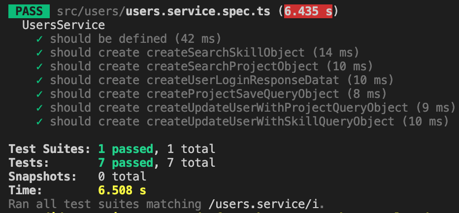
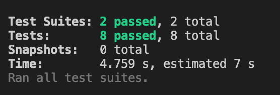

# CV Builder

CV Builder is a web application which will help you build up your resume in a couple of minutes. 

## Tech-Stack
- ReactJS & Redux
- NestJS (Typescript)
- MongoDB
- CSS/SASS


## Instructions to install and start application

CV-Builder is the parent directory. Inside the root directory, there are 2 folders - "client" and "nest-server". Frontend code (ReactJs) is present inside "client" directory and backend code (NestJs) is present inside "nest-server" directory.

### For installation of "client" dir. follow below steps:-

*Note* - Pre Requirements: Node - v14.18.0, npm - v6.14.15)
1. Inside "client" directory , run:

```bash
cd client/
nvm use 14
npm install
npm start
```

2. "client" will run on [localhost:3000](http://localhost:3000/)


### For installation of "nest-server" dir. follow below steps:-

*Note* - Pre Requirements: Install MongoDB Compass

1. There is an .env-example file inside "nest-server" directory which contains a paramter "MONGO_URL" to connect to MongoDB. Using that as a reference, create .env file and replace the connection URI of mongoDB with yours.

2. Inside "nest-server" directory, run:

```bash
cd nest-server/
npm install
npm run start:dev
```

3. "nest-server" will run on [localhost:8080](http://localhost:8080/)

4. Once server starts running, open MongoDB compass, you'll see a new collection has been created named "CVBuilder".


## Unit Testing

You can start unit tests by running:

```bash
npm test users.service
```

OR

```bash
npm run test
```

Below are the screenshots of the passed test cases:-
 




## DEMO

For reference, here is a link of "loom" video where I've given a quick 5 minute demo of the project

#### Video Link- [www.loom.com/share/1eec52c2295146b7913ec2b04c51d66a](https://www.loom.com/share/1eec52c2295146b7913ec2b04c51d66a)
